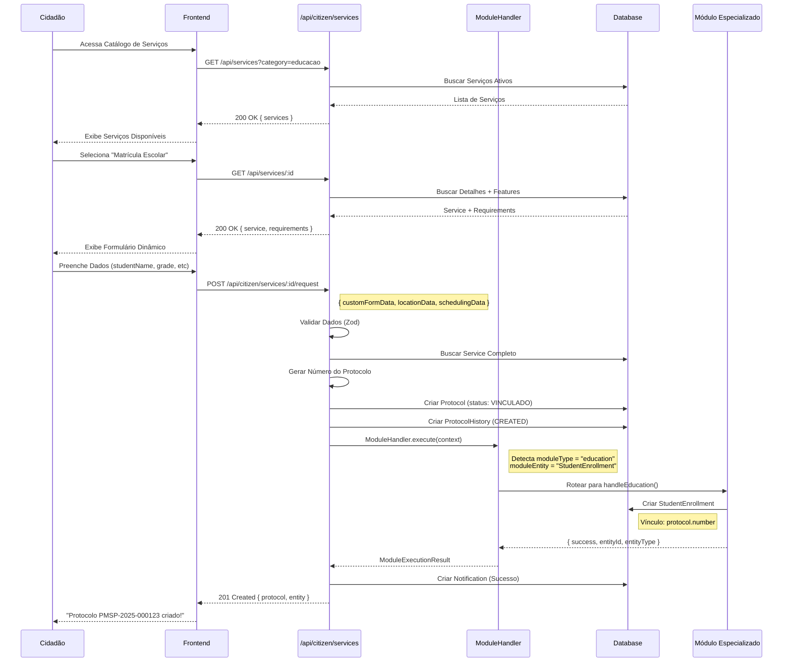
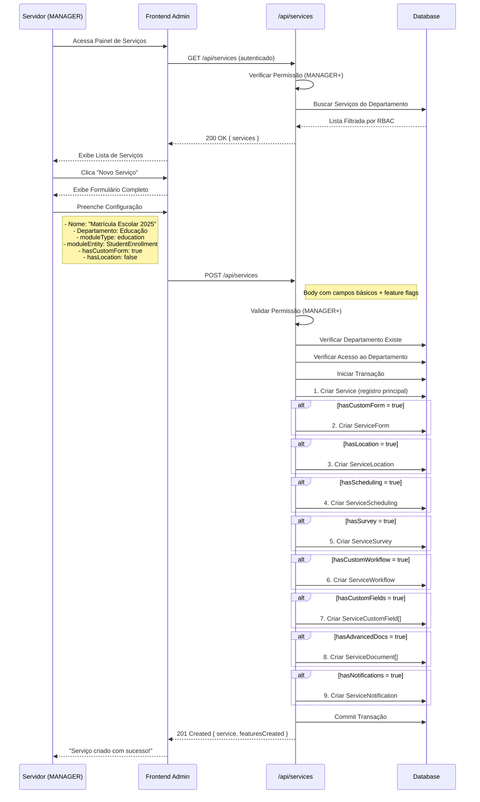
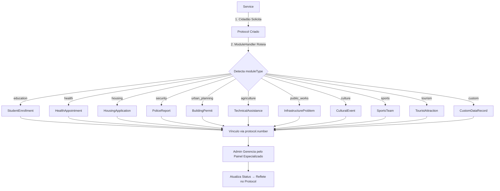

# FLUXO DOS SERVIÇOS - DigiUrban

## 📋 Visão Geral

O **Sistema de Serviços** é a espinha dorsal do DigiUrban, responsável por catalogar, gerenciar e rotear todas as solicitações de serviços públicos para os módulos especializados de cada secretaria.

---

## 🏗️ Arquitetura do Sistema de Serviços

```
┌─────────────────────────────────────────────────────────────────┐
│                    CAMADA DE CATÁLOGO                           │
├─────────────────────────────────────────────────────────────────┤
│  CIDADÃO                │  SERVIDOR               │  PREFEITO   │
│  - Buscar Serviços      │  - Criar Serviços       │  - Ver Tudo │
│  - Filtrar Categoria    │  - Editar Serviços      │  - Aprovar  │
│  - Solicitar Serviço    │  - Ver do Departamento  │  - Config.  │
└─────────────────────────────────────────────────────────────────┘
                              ↓
┌─────────────────────────────────────────────────────────────────┐
│                    CAMADA DE API REST                           │
├─────────────────────────────────────────────────────────────────┤
│  /api/services          │  /api/citizen/services                │
│  - GET / (público)      │  - POST /:id/request (autenticado)    │
│  - GET /:id (público)   │  - GET /popular                       │
│  - POST / (admin)       │  - GET /categories                    │
│  - PUT /:id (admin)     │  - GET /:id/requirements              │
│  - DELETE /:id (admin)  │  - GET /:id/similar                   │
└─────────────────────────────────────────────────────────────────┘
                              ↓
┌─────────────────────────────────────────────────────────────────┐
│                   MOTOR DE ROTEAMENTO                           │
├─────────────────────────────────────────────────────────────────┤
│  ModuleHandler - Detecta moduleType e roteia automaticamente   │
│  - education          → StudentEnrollment, SchoolTransport      │
│  - health             → HealthAppointment, MedicineRequest      │
│  - housing            → HousingApplication, RegularizationRequest│
│  - social             → SocialAssistance, BenefitRequest        │
│  - culture            → CulturalEvent, CulturalSpace            │
│  - sports             → SportsTeam, Athlete, Competition        │
│  - environment        → EnvironmentalLicense, TreeAuth          │
│  - security           → PoliceReport, PatrolRequest, CameraReq  │
│  - urban_planning     → BuildingPermit, Certificate, LotSubdiv  │
│  - agriculture        → TechnicalAssist, SeedDistribution       │
│  - tourism            → TouristAttraction, LocalBusiness        │
│  - public_works       → InfrastructureProblem, StreetMaint      │
│  - public_services    → TreePruning, WasteRemoval, Cleaning     │
│  - custom             → CustomDataRecord (tabelas dinâmicas)    │
└─────────────────────────────────────────────────────────────────┘
                              ↓
┌─────────────────────────────────────────────────────────────────┐
│                    CAMADA DE DADOS                              │
├─────────────────────────────────────────────────────────────────┤
│  Service (Catálogo)    │  Protocol (Solicitação)               │
│  - Configuração Base   │  - Vínculo com Serviço                │
│  - Feature Flags       │  - Criado via ModuleHandler            │
│  - Módulo Alvo         │                                        │
│                        │                                        │
│  Tabelas Especializadas (por secretaria)                       │
│  - StudentEnrollment   - HealthAppointment   - HousingApplication│
│  - PoliceReport        - BuildingPermit      - TechnicalAssist  │
│  - CulturalEvent       - SportsTeam          - TreePruning      │
└─────────────────────────────────────────────────────────────────┘
```

---

## 📊 Modelo de Dados - Service

```typescript
model Service {
  // Identificação
  id              String      @id @default(cuid())
  name            String      // Nome do serviço
  description     String?     // Descrição detalhada

  // Classificação
  category        String?     // Categoria (ex: "Educação", "Saúde")
  serviceType     String      @default("REQUEST") // REQUEST | FORM | APPOINTMENT

  // Relacionamentos
  tenantId        String      // Multi-tenancy
  departmentId    String      // Secretaria responsável
  department      Department

  // Roteamento de Módulo (CRÍTICO)
  moduleType      String?     // education, health, housing, etc.
  moduleEntity    String?     // StudentEnrollment, HealthAppointment, etc.
  fieldMapping    Json?       // Mapeamento de campos do form → entidade

  // Requisitos e Documentos
  requiresDocuments    Boolean @default(false)
  requiredDocuments    Json?
  estimatedDays        Int?    // Prazo estimado em dias

  // Feature Flags (configurações avançadas)
  hasCustomForm        Boolean @default(false)
  hasLocation          Boolean @default(false)
  hasScheduling        Boolean @default(false)
  hasSurvey            Boolean @default(false)
  hasCustomWorkflow    Boolean @default(false)
  hasCustomFields      Boolean @default(false)
  hasAdvancedDocs      Boolean @default(false)
  hasNotifications     Boolean @default(false)

  // Visual e Prioridade
  icon            String?
  color           String?
  priority        Int         @default(1) // Ordem de exibição

  // Estado
  isActive        Boolean     @default(true)
  createdAt       DateTime    @default(now())
  updatedAt       DateTime    @updatedAt

  // Relações com Features (se feature flags = true)
  customForm      ServiceForm?
  locationConfig  ServiceLocation?
  scheduling      ServiceScheduling?
  survey          ServiceSurvey?
  workflow        ServiceWorkflow?
  customFields    ServiceCustomField[]
  documents       ServiceDocument[]
  notifications   ServiceNotification?

  // Protocolos gerados deste serviço
  protocols       Protocol[]
}
```

---

## 🔄 Fluxo 1: Cidadão Solicita Serviço



**Destaques do Fluxo:**
1. ✅ **Catálogo Público**: Qualquer um pode ver serviços disponíveis
2. ✅ **Formulário Dinâmico**: Gerado baseado nas Features do Service
3. ✅ **Validações Automáticas**: Localização obrigatória se `hasLocation = true`
4. ✅ **Roteamento Inteligente**: ModuleHandler detecta qual handler usar
5. ✅ **Persistência Especializada**: Cria tanto Protocol quanto entidade específica

---

## 🔄 Fluxo 2: Servidor Cria Serviço (Admin)



**Componentes Criados:**
- ✅ **Service**: Registro base no catálogo
- ✅ **ServiceForm**: Formulário customizado (campos dinâmicos)
- ✅ **ServiceLocation**: Configuração de geolocalização
- ✅ **ServiceScheduling**: Agendamento (horários, slots)
- ✅ **ServiceSurvey**: Pesquisa de satisfação
- ✅ **ServiceWorkflow**: Fluxo customizado de aprovação
- ✅ **ServiceCustomField[]**: Campos extras específicos
- ✅ **ServiceDocument[]**: Documentos obrigatórios/opcionais
- ✅ **ServiceNotification**: Templates de notificações

---

## 🎯 Fluxo 3: Motor de Roteamento (ModuleHandler)

```
                    SOLICITAÇÃO DE SERVIÇO
                            ↓
                    ┌───────────────┐
                    │ ModuleHandler │
                    └───────┬───────┘
                            ↓
              ┌─────────────┴─────────────┐
              │   Detecta moduleType       │
              │   ex: "education"          │
              └─────────────┬──────────────┘
                            ↓
┌───────────────────────────┼───────────────────────────┐
│                           ↓                           │
│   switch (service.moduleType) {                       │
│                                                        │
│   ┌──────────────────────────────────────────────┐   │
│   │  case 'education':                           │   │
│   │    → handleEducation()                       │   │
│   │      - StudentEnrollment                     │   │
│   │      - SchoolTransport                       │   │
│   │      - StudentAttendance (genérico)          │   │
│   └──────────────────────────────────────────────┘   │
│                                                        │
│   ┌──────────────────────────────────────────────┐   │
│   │  case 'health':                              │   │
│   │    → handleHealth()                          │   │
│   │      - HealthAppointment                     │   │
│   │      - MedicineRequest                       │   │
│   │      - HealthAttendance (genérico)           │   │
│   └──────────────────────────────────────────────┘   │
│                                                        │
│   ┌──────────────────────────────────────────────┐   │
│   │  case 'housing':                             │   │
│   │    → handleHousing()                         │   │
│   │      - HousingApplication (MCMV)             │   │
│   │      - LotApplication                        │   │
│   │      - RegularizationRequest                 │   │
│   │      - HousingAid (Aluguel Social)           │   │
│   └──────────────────────────────────────────────┘   │
│                                                        │
│   ┌──────────────────────────────────────────────┐   │
│   │  case 'security':                            │   │
│   │    → handleSecurity()                        │   │
│   │      - PoliceReport (Boletim de Ocorrência)  │   │
│   │      - PatrolRequest (Solicitação de Ronda)  │   │
│   │      - CameraRequest (Câmeras de Segurança)  │   │
│   │      - AnonymousTip (Denúncia Anônima)       │   │
│   └──────────────────────────────────────────────┘   │
│                                                        │
│   ┌──────────────────────────────────────────────┐   │
│   │  case 'urban_planning':                      │   │
│   │    → handleUrbanPlanning()                   │   │
│   │      - BuildingPermit (Alvará de Construção) │   │
│   │      - Certificate (Certidão)                │   │
│   │      - PropertyNumbering (Numeração)         │   │
│   │      - LotSubdivision (Parcelamento)         │   │
│   └──────────────────────────────────────────────┘   │
│                                                        │
│   ┌──────────────────────────────────────────────┐   │
│   │  case 'agriculture':                         │   │
│   │    → handleAgriculture()                     │   │
│   │      - TechnicalAssistance (ATER)            │   │
│   │      - SeedDistribution                      │   │
│   │      - SoilAnalysis                          │   │
│   │      - FarmerMarket (Feira do Produtor)      │   │
│   └──────────────────────────────────────────────┘   │
│                                                        │
│   ┌──────────────────────────────────────────────┐   │
│   │  case 'public_works':                        │   │
│   │    → handlePublicWorks()                     │   │
│   │      - InfrastructureProblem (Buracos)       │   │
│   │      - StreetMaintenance (Pavimentação)      │   │
│   │      - Accessibility (Acessibilidade)        │   │
│   │      - Signage (Sinalização)                 │   │
│   └──────────────────────────────────────────────┘   │
│                                                        │
│   ┌──────────────────────────────────────────────┐   │
│   │  case 'public_services':                     │   │
│   │    → handlePublicServices()                  │   │
│   │      - TreePruning (Poda de Árvores)         │   │
│   │      - WasteRemoval (Retirada de Entulho)    │   │
│   │      - PestControl (Controle de Pragas)      │   │
│   │      - Cleaning (Limpeza)                    │   │
│   │      - GarbageCollection (Coleta de Lixo)    │   │
│   └──────────────────────────────────────────────┘   │
│                                                        │
│   ┌──────────────────────────────────────────────┐   │
│   │  case 'culture':                             │   │
│   │    → handleCulture()                         │   │
│   │      - CulturalSpace (Espaços Culturais)     │   │
│   │      - CulturalProject (Lei de Incentivo)    │   │
│   │      - CulturalEvent (Eventos)               │   │
│   │      - CulturalWorkshop (Oficinas)           │   │
│   └──────────────────────────────────────────────┘   │
│                                                        │
│   ┌──────────────────────────────────────────────┐   │
│   │  case 'sports':                              │   │
│   │    → handleSports()                          │   │
│   │      - SportsTeam (Escolinhas)               │   │
│   │      - Athlete (Cadastro de Atleta)          │   │
│   │      - Competition (Campeonatos)             │   │
│   └──────────────────────────────────────────────┘   │
│                                                        │
│   ┌──────────────────────────────────────────────┐   │
│   │  case 'tourism':                             │   │
│   │    → handleTourism()                         │   │
│   │      - TouristAttraction (Atrativos)         │   │
│   │      - LocalBusiness (Comércio Local)        │   │
│   │      - TourismProgram (Programas)            │   │
│   └──────────────────────────────────────────────┘   │
│                                                        │
│   ┌──────────────────────────────────────────────┐   │
│   │  case 'environment':                         │   │
│   │    → handleEnvironment()                     │   │
│   │      - TreeAuthorization (Corte de Árvore)   │   │
│   │      - EnvironmentalLicense                  │   │
│   │      - EnvironmentalComplaint                │   │
│   │      - OrganicCertification                  │   │
│   └──────────────────────────────────────────────┘   │
│                                                        │
│   ┌──────────────────────────────────────────────┐   │
│   │  case 'social':                              │   │
│   │    → handleSocial()                          │   │
│   │      - SocialAssistance                      │   │
│   │      - BenefitRequest (Cesta Básica)         │   │
│   └──────────────────────────────────────────────┘   │
│                                                        │
│   ┌──────────────────────────────────────────────┐   │
│   │  case 'custom':                              │   │
│   │    → handleCustomModule()                    │   │
│   │      - CustomDataTable (tabela dinâmica)     │   │
│   │      - CustomDataRecord (registro flexível)  │   │
│   └──────────────────────────────────────────────┘   │
│                                                        │
│   ┌──────────────────────────────────────────────┐   │
│   │  default:                                    │   │
│   │    → Serviço Genérico (apenas Protocol)     │   │
│   └──────────────────────────────────────────────┘   │
│                                                        │
└────────────────────────────────────────────────────────┘
                            ↓
              ┌─────────────────────────┐
              │  RESULTADO DO HANDLER    │
              │  - success: true/false   │
              │  - entityId: cuid        │
              │  - entityType: string    │
              │  - data: object          │
              └──────────┬───────────────┘
                         ↓
              ┌─────────────────────────┐
              │  Protocol Criado +       │
              │  Entidade Especializada  │
              └──────────────────────────┘
```

---

## 🛠️ Fluxo 4: Sistema de Features (Feature Flags)

```
SERVICE CRIADO
    ↓
┌───────────────────────────────────────────────────┐
│  FEATURE FLAGS (booleans no Service)              │
├───────────────────────────────────────────────────┤
│  hasCustomForm      = true/false                  │
│  hasLocation        = true/false                  │
│  hasScheduling      = true/false                  │
│  hasSurvey          = true/false                  │
│  hasCustomWorkflow  = true/false                  │
│  hasCustomFields    = true/false                  │
│  hasAdvancedDocs    = true/false                  │
│  hasNotifications   = true/false                  │
└───────────────────────────────────────────────────┘
    ↓
FRONTEND DETECTA FLAGS
    ↓
┌───────────────────────────────────────────────────┐
│  RENDERIZAÇÃO CONDICIONAL                         │
├───────────────────────────────────────────────────┤
│                                                    │
│  if (hasCustomForm) {                             │
│    → Renderizar campos do ServiceForm             │
│    → Validar campos obrigatórios                  │
│  }                                                 │
│                                                    │
│  if (hasLocation) {                               │
│    → Exibir Mapa para Geolocalização              │
│    → Validar se está dentro do geofence           │
│    → Calcular distância do centro                 │
│  }                                                 │
│                                                    │
│  if (hasScheduling) {                             │
│    → Exibir Calendário                            │
│    → Mostrar Horários Disponíveis                 │
│    → Validar dias úteis + working hours           │
│    → Aplicar maxPerDay e slotDuration             │
│  }                                                 │
│                                                    │
│  if (hasSurvey) {                                 │
│    → Após conclusão, exibir pesquisa              │
│    → Coletar feedback (rating 1-5)                │
│  }                                                 │
│                                                    │
│  if (hasCustomWorkflow) {                         │
│    → Usar workflow customizado (steps)            │
│    → Aplicar regras de transição                  │
│  }                                                 │
│                                                    │
│  if (hasCustomFields) {                           │
│    → Renderizar campos extras                     │
│    → Validar campos custom required               │
│  }                                                 │
│                                                    │
│  if (hasAdvancedDocs) {                           │
│    → Upload com validação por documento           │
│    → Aplicar maxSize, acceptedTypes               │
│    → Validar com AI (se validateWithAI = true)    │
│  }                                                 │
│                                                    │
│  if (hasNotifications) {                          │
│    → Enviar notificações em eventos específicos   │
│    → Usar templates configurados                  │
│  }                                                 │
│                                                    │
└───────────────────────────────────────────────────┘
    ↓
VALIDAÇÃO NO BACKEND
    ↓
┌───────────────────────────────────────────────────┐
│  VALIDAÇÕES CONDICIONAIS                          │
├───────────────────────────────────────────────────┤
│                                                    │
│  if (hasLocation && !locationData) {              │
│    throw "Localização é obrigatória"              │
│  }                                                 │
│                                                    │
│  if (hasScheduling && !schedulingData) {          │
│    throw "Agendamento é obrigatório"              │
│  }                                                 │
│                                                    │
│  if (hasCustomForm) {                             │
│    validate customFormData against formSchema     │
│  }                                                 │
│                                                    │
└───────────────────────────────────────────────────┘
    ↓
CRIAR PROTOCOL + ENTIDADES
```

---

## 📍 Feature: Geolocalização (hasLocation = true)

```
SERVIÇO COM GEOLOCALIZAÇÃO
    ↓
ServiceLocation {
  requiresLocation: true,
  locationType: "required",
  hasGeofencing: true,
  allowedRadius: 50, // km
  centerLat: -23.550520,
  centerLng: -46.633308,
  requireAddress: true,
  requireReference: true
}
    ↓
CIDADÃO SOLICITA
    ↓
┌─────────────────────────────────┐
│  FRONTEND                       │
│  - Exibe Mapa Interativo        │
│  - Cidadão Clica no Local       │
│  - Captura lat/lng              │
│  - Preenche Endereço            │
│  - Adiciona Referência          │
└─────────────────────────────────┘
    ↓
POST /api/citizen/services/:id/request
{
  description: "Buraco na rua",
  locationData: {
    latitude: -23.555,
    longitude: -46.639,
    address: "Av. Paulista, 1000",
    reference: "Em frente ao MASP"
  }
}
    ↓
BACKEND VALIDA
    ↓
┌─────────────────────────────────┐
│  1. Verificar se locationData   │
│     foi fornecido               │
│  2. Calcular distância do       │
│     centro (Haversine)          │
│  3. Se distance > allowedRadius │
│     → Rejeitar (400)            │
│  4. Se válido → Criar Protocol  │
│     com lat/lng                 │
│  5. Criar ProtocolLocation      │
└─────────────────────────────────┘
    ↓
SALVO NO PROTOCOL
{
  latitude: -23.555,
  longitude: -46.639,
  endereco: "Av. Paulista, 1000"
}
+
ProtocolLocation {
  protocolId: "prt_123",
  locationConfigId: "loc_456",
  latitude: -23.555,
  longitude: -46.639,
  address: "Av. Paulista, 1000"
}
```

---

## 📅 Feature: Agendamento (hasScheduling = true)

```
SERVIÇO COM AGENDAMENTO
    ↓
ServiceScheduling {
  allowScheduling: true,
  type: "appointment",
  workingHours: {
    monday: { start: "08:00", end: "17:00" },
    tuesday: { start: "08:00", end: "17:00" },
    ...
  },
  blockouts: [
    { date: "2025-01-01", reason: "Feriado" }
  ],
  slotDuration: 30, // minutos
  bufferTime: 10, // minutos entre slots
  maxPerDay: 20, // limite diário
  maxPerSlot: 1, // 1 pessoa por vez
  advanceBooking: 30, // agendamento até 30 dias
  minAdvanceDays: 1,
  maxAdvanceDays: 30,
  availableDays: ["monday", "tuesday", "wednesday", "thursday", "friday"],
  sendReminder: true,
  reminderHours: 24
}
    ↓
FRONTEND CONSULTA SLOTS
    ↓
GET /api/services/:id/scheduling/available-slots?date=2025-01-15
    ↓
BACKEND CALCULA
    ↓
┌─────────────────────────────────────────┐
│  1. Buscar workingHours para o dia      │
│  2. Verificar se dia está disponível    │
│  3. Buscar blockouts                    │
│  4. Buscar agendamentos existentes      │
│  5. Calcular slots disponíveis          │
│     - Início: 08:00                     │
│     - Duração: 30 min                   │
│     - Buffer: 10 min                    │
│     - Slots: 08:00, 08:40, 09:20, ...   │
│  6. Filtrar slots já ocupados           │
│  7. Retornar slots livres               │
└─────────────────────────────────────────┘
    ↓
RESPOSTA
{
  availableSlots: [
    { time: "08:00", available: true },
    { time: "08:40", available: true },
    { time: "09:20", available: false }, // ocupado
    { time: "10:00", available: true },
    ...
  ]
}
    ↓
CIDADÃO SELECIONA SLOT
    ↓
POST /api/citizen/services/:id/request
{
  schedulingData: {
    scheduledDate: "2025-01-15",
    scheduledTime: "10:00",
    notes: "Preferência pela manhã"
  }
}
    ↓
BACKEND CRIA APPOINTMENT
    ↓
Appointment {
  protocolId: "prt_123",
  scheduledDate: "2025-01-15T10:00:00Z",
  scheduledTime: "10:00",
  status: "AGENDADO",
  notes: "Preferência pela manhã"
}
    ↓
NOTIFICAÇÃO ENVIADA
"Seu agendamento foi confirmado para 15/01/2025 às 10:00"
```

---

## 📋 Estrutura de Dados: Service + Features

```typescript
// Exemplo completo de um serviço configurado

Service: {
  id: "srv_matricula_escolar",
  name: "Matrícula Escolar 2025",
  description: "Solicitação de vaga em escola municipal",
  category: "Educação",
  departmentId: "dept_educacao",

  // ROTEAMENTO (módulo alvo)
  moduleType: "education",
  moduleEntity: "StudentEnrollment",
  fieldMapping: {
    "studentName": "nome_aluno",
    "parentName": "nome_responsavel",
    "birthDate": "data_nascimento",
    "desiredGrade": "serie_desejada"
  },

  // FEATURE FLAGS
  hasCustomForm: true,
  hasLocation: false,
  hasScheduling: true,
  hasSurvey: true,
  hasCustomWorkflow: false,
  hasCustomFields: true,
  hasAdvancedDocs: true,
  hasNotifications: true,

  // VISUAL
  icon: "GraduationCap",
  color: "#4CAF50",
  priority: 10,
  isActive: true
}

// ============ FEATURES ASSOCIADAS ============

ServiceForm: {
  serviceId: "srv_matricula_escolar",
  title: "Formulário de Matrícula",
  description: "Preencha os dados do aluno",
  isRequired: true,
  fields: [
    {
      id: "studentName",
      type: "text",
      label: "Nome do Aluno",
      required: true,
      placeholder: "Nome completo"
    },
    {
      id: "birthDate",
      type: "date",
      label: "Data de Nascimento",
      required: true,
      validation: { maxDate: "today" }
    },
    {
      id: "desiredGrade",
      type: "select",
      label: "Série Desejada",
      required: true,
      options: [
        { value: "1", label: "1º Ano" },
        { value: "2", label: "2º Ano" },
        ...
      ]
    }
  ],
  isMultiStep: false
}

ServiceScheduling: {
  serviceId: "srv_matricula_escolar",
  allowScheduling: true,
  type: "appointment",
  workingHours: {
    monday: { start: "08:00", end: "17:00" },
    tuesday: { start: "08:00", end: "17:00" },
    wednesday: { start: "08:00", end: "17:00" },
    thursday: { start: "08:00", end: "17:00" },
    friday: { start: "08:00", end: "17:00" }
  },
  slotDuration: 30,
  bufferTime: 0,
  maxPerDay: 50,
  maxPerSlot: 1,
  advanceBooking: 60,
  minAdvanceDays: 1,
  maxAdvanceDays: 60
}

ServiceCustomField[]: [
  {
    serviceId: "srv_matricula_escolar",
    key: "hasSpecialNeeds",
    label: "Possui Necessidades Especiais?",
    type: "boolean",
    required: false,
    order: 1
  },
  {
    serviceId: "srv_matricula_escolar",
    key: "specialNeedsDescription",
    label: "Descreva as Necessidades",
    type: "text",
    required: false,
    order: 2,
    conditional: {
      field: "hasSpecialNeeds",
      value: true
    }
  }
]

ServiceDocument[]: [
  {
    serviceId: "srv_matricula_escolar",
    name: "RG ou Certidão de Nascimento",
    description: "Documento de identificação do aluno",
    category: "identificacao",
    required: true,
    multiple: false,
    acceptedTypes: ["application/pdf", "image/jpeg", "image/png"],
    maxSize: 5242880, // 5 MB
    order: 1
  },
  {
    serviceId: "srv_matricula_escolar",
    name: "Comprovante de Residência",
    description: "Conta de luz, água ou telefone (últimos 3 meses)",
    category: "residencia",
    required: true,
    multiple: false,
    acceptedTypes: ["application/pdf", "image/jpeg"],
    maxSize: 5242880,
    order: 2
  }
]

ServiceSurvey: {
  serviceId: "srv_matricula_escolar",
  title: "Avalie nosso atendimento",
  description: "Sua opinião é importante!",
  type: "satisfaction",
  timing: "after",
  isRequired: false,
  showAfter: "completion",
  daysAfter: 7,
  questions: [
    {
      id: "q1",
      type: "rating",
      question: "Como você avalia o atendimento?",
      required: true,
      scale: 5
    },
    {
      id: "q2",
      type: "text",
      question: "Sugestões de melhoria",
      required: false
    }
  ]
}

ServiceNotification: {
  serviceId: "srv_matricula_escolar",
  enabled: true,
  templates: [
    {
      trigger: "PROTOCOL_CREATED",
      title: "Matrícula Solicitada",
      message: "Sua solicitação de matrícula foi recebida. Protocolo: {{number}}",
      channel: "WEB"
    },
    {
      trigger: "STATUS_CHANGED_TO_PROGRESSO",
      title: "Matrícula em Análise",
      message: "Sua solicitação está sendo analisada pela Secretaria de Educação",
      channel: "WEB"
    },
    {
      trigger: "STATUS_CHANGED_TO_CONCLUIDO",
      title: "Matrícula Aprovada!",
      message: "Sua matrícula foi aprovada. Compareça à escola em até 3 dias úteis.",
      channel: "WEB"
    }
  ]
}
```

---

## 🔐 Controle de Acesso por Perfil

```
┌─────────────────────────────────────────────────────┐
│  CIDADÃO (Citizen)                                  │
├─────────────────────────────────────────────────────┤
│  ✅ Listar serviços (GET /api/services)             │
│  ✅ Ver detalhes (GET /api/services/:id)            │
│  ✅ Ver categorias (GET /api/services/categories)   │
│  ✅ Ver populares (GET /api/services/popular)       │
│  ✅ Solicitar serviço (POST /api/citizen/services/:id/request)│
│  ❌ Criar serviço (sem acesso)                      │
│  ❌ Editar serviço (sem acesso)                     │
│  ❌ Deletar serviço (sem acesso)                    │
└─────────────────────────────────────────────────────┘

┌─────────────────────────────────────────────────────┐
│  USER (Funcionário)                                 │
├─────────────────────────────────────────────────────┤
│  ✅ Listar serviços                                 │
│  ✅ Ver detalhes                                    │
│  ❌ Criar serviço (sem acesso)                      │
│  ❌ Editar serviço (sem acesso)                     │
│  ❌ Deletar serviço (sem acesso)                    │
│  ✅ Processar protocolos gerados dos serviços       │
└─────────────────────────────────────────────────────┘

┌─────────────────────────────────────────────────────┐
│  COORDINATOR (Coordenador)                          │
├─────────────────────────────────────────────────────┤
│  ✅ Listar serviços do departamento                 │
│  ✅ Ver detalhes                                    │
│  ❌ Criar serviço (sem acesso)                      │
│  ❌ Editar serviço (sem acesso)                     │
│  ❌ Deletar serviço (sem acesso)                    │
└─────────────────────────────────────────────────────┘

┌─────────────────────────────────────────────────────┐
│  MANAGER (Gestor de Secretaria)                    │
├─────────────────────────────────────────────────────┤
│  ✅ Listar serviços do departamento                 │
│  ✅ Ver detalhes                                    │
│  ✅ Criar serviço (POST /api/services)              │
│  ✅ Editar serviço do departamento (PUT /api/services/:id)│
│  ✅ Desativar serviço do departamento (DELETE /api/services/:id)│
│  ❌ Editar serviços de outros departamentos         │
└─────────────────────────────────────────────────────┘

┌─────────────────────────────────────────────────────┐
│  ADMIN (Administrador)                              │
├─────────────────────────────────────────────────────┤
│  ✅ Listar TODOS os serviços do tenant              │
│  ✅ Ver detalhes                                    │
│  ✅ Criar serviço de qualquer departamento          │
│  ✅ Editar qualquer serviço                         │
│  ✅ Desativar qualquer serviço                      │
│  ✅ Ver estatísticas globais                        │
└─────────────────────────────────────────────────────┘

┌─────────────────────────────────────────────────────┐
│  SUPER_ADMIN (Prefeito)                             │
├─────────────────────────────────────────────────────┤
│  ✅ ACESSO TOTAL (mesmas permissões do ADMIN)       │
│  ✅ Criar chamados vinculando cidadão e setor       │
│  ✅ Criar serviços de qualquer departamento         │
│  ✅ Configurações avançadas de tenant               │
└─────────────────────────────────────────────────────┘
```

---

## 📊 Endpoints da API

### Endpoints Públicos (Cidadão)

```typescript
GET /api/services
  ↳ Listar serviços ativos
  Query: ?category=educacao&search=matricula&page=1&limit=20
  Response: { services: [...], pagination: {...} }

GET /api/services/:id
  ↳ Detalhes de um serviço
  Response: { service: {...}, stats: {...} }

GET /api/services/categories
  ↳ Listar categorias com contagem
  Response: { categories: [{ name: "Educação", count: 15 }] }

GET /api/services/popular
  ↳ Serviços mais solicitados
  Query: ?limit=10
  Response: { services: [...] }

GET /api/services/:id/requirements
  ↳ Requisitos e documentos necessários
  Response: { requirements: [...], documents: [...] }

GET /api/services/:id/similar
  ↳ Serviços similares (mesma categoria)
  Response: { services: [...] }
```

### Endpoints Autenticados (Cidadão)

```typescript
POST /api/citizen/services/:id/request
  ↳ Solicitar um serviço (cria Protocol + Entidade)
  Headers: Authorization: Bearer {citizen_token}
  Body: {
    description: "Solicito matrícula para meu filho",
    customFormData: {
      studentName: "João Silva",
      birthDate: "2015-05-10",
      desiredGrade: "1"
    },
    locationData: {
      latitude: -23.555,
      longitude: -46.639,
      address: "Rua A, 123"
    },
    schedulingData: {
      scheduledDate: "2025-02-01",
      scheduledTime: "10:00"
    },
    attachments: [...]
  }
  Response: 201 { protocol: {...}, entity: {...} }
```

### Endpoints Admin

```typescript
// ========== CRUD DE SERVIÇOS ==========

POST /api/services
  ↳ Criar novo serviço
  Permissão: MANAGER+
  Body: {
    name: "Matrícula Escolar 2025",
    description: "...",
    departmentId: "dept_123",
    category: "Educação",
    moduleType: "education",
    moduleEntity: "StudentEnrollment",
    hasCustomForm: true,
    hasScheduling: true,
    customForm: {...},
    scheduling: {...}
  }
  Response: 201 { service: {...}, featuresCreated: {...} }

PUT /api/services/:id
  ↳ Atualizar serviço existente
  Permissão: MANAGER+ (apenas do próprio departamento)
  Body: { name: "Novo Nome", isActive: false, ... }
  Response: 200 { service: {...} }

DELETE /api/services/:id
  ↳ Desativar serviço (soft delete)
  Permissão: MANAGER+
  Validação: Bloqueia se há protocolos ativos
  Response: 200 { message: "Serviço desativado" }

// ========== CONSULTAS ESPECIALIZADAS ==========

GET /api/services/department/:departmentId
  ↳ Listar serviços de um departamento
  Response: { services: [...] }

GET /api/admin/services/stats
  ↳ Estatísticas de uso dos serviços
  Response: {
    totalServices: 150,
    activeServices: 140,
    byCategory: [...],
    mostUsed: [...]
  }
```

---

## 🎨 Fluxo Visual Completo

```
PREFEITO/GESTOR
   ↓
PAINEL ADMINISTRATIVO
   ↓
CRIA SERVIÇO
(configura nome, departamento, módulo, features)
   ↓
   └────────────────────────────────────────────────────┐
                                                        │
										                │
   										                ↓
									        SERVIÇO FICA ATIVO NO CATÁLOGO
  										                ↓
                                       CIDADÃO ACESSA CATÁLOGO
										                ↓
┌─────────────────────────────────┐     ┌──────────────────────────────────┐
│       CATÁLOGO DE SERVIÇOS      │     │       DETALHES DO SERVIÇO        │
│  (categoria / busca / popular)  │ ←──→│  (descrição / requisitos / docs) │
└────────────┬────────────────────┘     └─────────────────┬────────────────┘
            ↑				             			       │
	        │								               │
	        │   			  	  	 			           ↓
		    │                              ┌───────────────────────────┐
		    │                              ↓                           ↓
      ┌──────────────┐           ┌──────────────┐         ┌──────────────────┐
      │ SOLICITAR    │           │  FORMULÁRIO  │         │   AGENDAMENTO    │
      │   SERVIÇO    │           │  CUSTOMIZADO │         │   (se habilitado)│
      └──────┬───────┘           └──────┬───────┘         └────────┬─────────┘
		     ↑	    		              ↑				              │
		     │		     	              │					          │
		     │				              │					          ↓
		     │				              │		          ┌──────────────────┐
		     │	   				          └───────────────│  GEOLOCALIZAÇÃO  │
		     │							                  │  (se habilitado) │
             │							                  └────────┬─────────┘
		     │									                   │
		     │									                   │
		     │									                   ↓
		     │							                  ┌──────────────────┐
		     │							                  │  CONFIRMAR       │
		     │							                  │  SOLICITAÇÃO     │
		     │							                  └────────┬─────────┘
		     │									                   │
		     │									                   │
		     └────────────────────────────────────────────────────────┘
             │                                                         ↓
		     │							                  ┌──────────────────┐
		     │							                  │  PROTOCOL +      │
		     │							                  │  ENTIDADE        │
		     │							                  │  ESPECIALIZADA   │
		     │							                  └────────┬─────────┘
		     │								                       │
             └─────────────────────────────────────────────────────────┘
                                                                       ↓
                                                         ┌──────────────────────┐
                                                         │  NOTIFICAÇÃO         │
                                                         │  "Protocolo Criado!" │
                                                         └──────────────────────┘
```

---

## 🔗 Integração com Protocolos



**Fluxo de Integração:**

1. **Cidadão solicita serviço** → Cria Protocol (status: VINCULADO)
2. **ModuleHandler detecta moduleType** → Roteia para handler especializado
3. **Handler cria entidade** → Ex: StudentEnrollment, HealthAppointment
4. **Vínculo estabelecido** → protocol.number conecta ambos
5. **Admin acessa painel** → Vê solicitação no módulo especializado
6. **Admin aprova/rejeita** → Atualiza status da entidade
7. **Status reflete no Protocol** → Cidadão vê atualização
8. **Histórico registrado** → ProtocolHistory captura todas ações

---

## 📈 Métricas e Estatísticas

```typescript
// Dashboard de Serviços

GET /api/admin/services/stats
{
  "totalServices": 150,
  "activeServices": 142,
  "inactiveServices": 8,
  "byCategory": [
    { "category": "Educação", "count": 35 },
    { "category": "Saúde", "count": 28 },
    { "category": "Habitação", "count": 15 },
    { "category": "Segurança", "count": 12 },
    { "category": "Obras Públicas", "count": 20 },
    { "category": "Meio Ambiente", "count": 10 },
    { "category": "Cultura", "count": 8 },
    { "category": "Esporte", "count": 6 },
    { "category": "Turismo", "count": 5 },
    { "category": "Agricultura", "count": 13 }
  ],
  "mostUsed": [
    {
      "service": "Matrícula Escolar",
      "protocolsCount": 1250,
      "avgCompletionDays": 15
    },
    {
      "service": "Consulta Médica",
      "protocolsCount": 980,
      "avgCompletionDays": 7
    },
    {
      "service": "MCMV - Minha Casa Minha Vida",
      "protocolsCount": 750,
      "avgCompletionDays": 90
    }
  ],
  "byFeature": {
    "hasCustomForm": 85,
    "hasLocation": 42,
    "hasScheduling": 38,
    "hasSurvey": 60,
    "hasCustomWorkflow": 12,
    "hasCustomFields": 55,
    "hasAdvancedDocs": 48,
    "hasNotifications": 90
  }
}
```

---

## 🚀 Exemplos de Módulos Especializados

### 1. Educação → StudentEnrollment

```typescript
Service {
  name: "Matrícula Escolar 2025",
  moduleType: "education",
  moduleEntity: "StudentEnrollment"
}

↓ CIDADÃO SOLICITA ↓

StudentEnrollment {
  id: "enr_123",
  tenantId: "tenant_sp",
  protocol: "PMSP-2025-000456",
  studentName: "Maria Silva",
  birthDate: "2015-03-10",
  parentName: "José Silva",
  parentCpf: "123.456.789-00",
  desiredGrade: "1",
  desiredShift: "MANHA",
  status: "PENDING"
}
```

### 2. Saúde → HealthAppointment

```typescript
Service {
  name: "Consulta Especializada",
  moduleType: "health",
  moduleEntity: "HealthAppointment"
}

↓ CIDADÃO SOLICITA ↓

HealthAppointment {
  id: "apt_789",
  protocol: "PMSP-2025-000457",
  patientName: "João Santos",
  patientCpf: "987.654.321-00",
  specialty: "Cardiologia",
  preferredDate: "2025-02-15",
  symptoms: "Dor no peito",
  urgency: "HIGH",
  status: "PENDING"
}
```

### 3. Habitação → HousingApplication

```typescript
Service {
  name: "MCMV - Minha Casa Minha Vida",
  moduleType: "housing",
  moduleEntity: "HousingApplication"
}

↓ CIDADÃO SOLICITA ↓

HousingApplication {
  id: "happ_456",
  protocol: "PMSP-2025-000458",
  applicantName: "Ana Souza",
  applicantCpf: "111.222.333-44",
  familyIncome: 2500.00,
  familyMembers: 4,
  hasDisabledMember: false,
  currentAddress: "Rua A, 100",
  status: "PENDING"
}
```

### 4. Segurança → PoliceReport

```typescript
Service {
  name: "Boletim de Ocorrência Online",
  moduleType: "security",
  moduleEntity: "PoliceReport"
}

↓ CIDADÃO SOLICITA ↓

PoliceReport {
  id: "pr_321",
  protocol: "PMSP-2025-000459",
  reporterName: "Carlos Oliveira",
  reporterCpf: "555.666.777-88",
  incidentType: "FURTO",
  incidentDate: "2025-01-20T14:00:00Z",
  location: "Rua B, 200",
  description: "Furto de bicicleta em via pública",
  witnesses: ["Pedro Lima"],
  status: "PENDING"
}
```

### 5. Planejamento Urbano → BuildingPermit

```typescript
Service {
  name: "Alvará de Construção",
  moduleType: "urban_planning",
  moduleEntity: "BuildingPermit"
}

↓ CIDADÃO SOLICITA ↓

BuildingPermit {
  id: "bp_654",
  protocol: "PMSP-2025-000460",
  applicantName: "Construtora XYZ",
  applicantCnpj: "12.345.678/0001-99",
  propertyAddress: "Av. Principal, 500",
  constructionType: "RESIDENCIAL",
  totalArea: 250.50,
  floors: 2,
  status: "PENDING"
}
```

---

## 🔧 Sistema de Templates (Service Templates)

```
┌─────────────────────────────────────────────┐
│  SERVICE TEMPLATE                           │
│  (Modelo pré-configurado)                   │
├─────────────────────────────────────────────┤
│  name: "Matrícula Escolar [Template]"      │
│  category: "Educação"                       │
│  moduleType: "education"                    │
│  moduleEntity: "StudentEnrollment"          │
│  hasCustomForm: true                        │
│  hasScheduling: true                        │
│  customFormConfig: {...}                    │
│  schedulingConfig: {...}                    │
│  isTemplate: true                           │
└─────────────────────────────────────────────┘
         ↓
GESTOR CRIA SERVIÇO A PARTIR DO TEMPLATE
         ↓
┌─────────────────────────────────────────────┐
│  SERVICE (Instância do Template)            │
├─────────────────────────────────────────────┤
│  name: "Matrícula Escolar 2025"            │
│  (herda todas configurações do template)    │
│  isTemplate: false                          │
│  isActive: true                             │
└─────────────────────────────────────────────┘
```

---

## 📝 Resumo dos Fluxos

### Fluxo Completo de Vida de um Serviço

```
1. CRIAÇÃO (Gestor)
   ↓
2. CONFIGURAÇÃO (Features + Módulo)
   ↓
3. ATIVAÇÃO (isActive = true)
   ↓
4. PUBLICAÇÃO (Aparece no catálogo)
   ↓
5. SOLICITAÇÃO (Cidadão)
   ↓
6. ROTEAMENTO (ModuleHandler)
   ↓
7. PERSISTÊNCIA (Protocol + Entidade)
   ↓
8. PROCESSAMENTO (Admin no módulo)
   ↓
9. CONCLUSÃO (Status = CONCLUIDO)
   ↓
10. AVALIAÇÃO (Survey, se habilitado)
```

---

## 🎯 Pontos-Chave do Sistema

1. ✅ **Multi-tenant**: Isolamento total por prefeitura
2. ✅ **Modular**: 13+ módulos especializados
3. ✅ **Configurável**: Feature flags para recursos avançados
4. ✅ **Extensível**: Custom modules para casos específicos
5. ✅ **Rastreável**: Vínculo Protocol ↔ Entidade via protocol.number
6. ✅ **Inteligente**: ModuleHandler roteia automaticamente
7. ✅ **Flexível**: Formulários e workflows customizados
8. ✅ **Seguro**: RBAC por perfil (Cidadão/USER/MANAGER/ADMIN)

---

## 📚 Referências de Código

### Backend
- [src/types/services.ts](digiurban/backend/src/types/services.ts) - Tipos centralizados
- [src/routes/services.ts](digiurban/backend/src/routes/services.ts) - CRUD de serviços
- [src/routes/citizen-services.ts](digiurban/backend/src/routes/citizen-services.ts) - Solicitações
- [src/modules/module-handler.ts](digiurban/backend/src/modules/module-handler.ts) - Roteador principal
- [src/modules/handlers/](digiurban/backend/src/modules/handlers/) - Handlers especializados

### Frontend
- [hooks/useServices.ts](digiurban/frontend/hooks/useServices.ts) - Hook geral
- [hooks/useCitizenServices.ts](digiurban/frontend/hooks/useCitizenServices.ts) - Hook cidadão
- [lib/services/](digiurban/frontend/lib/services/) - Services por módulo

### Database
- [prisma/schema.prisma](digiurban/backend/prisma/schema.prisma) - Schema completo

---

**Documento gerado em:** 28/10/2025
**Versão:** 1.0
**Sistema:** DigiUrban - Plataforma de Gestão Municipal
**Autor:** Sistema de Documentação Automática
